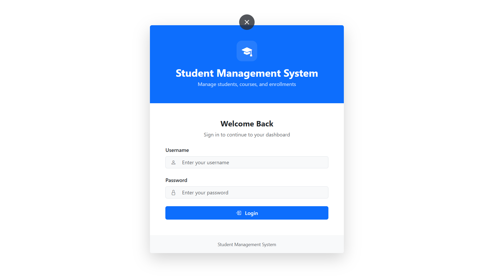
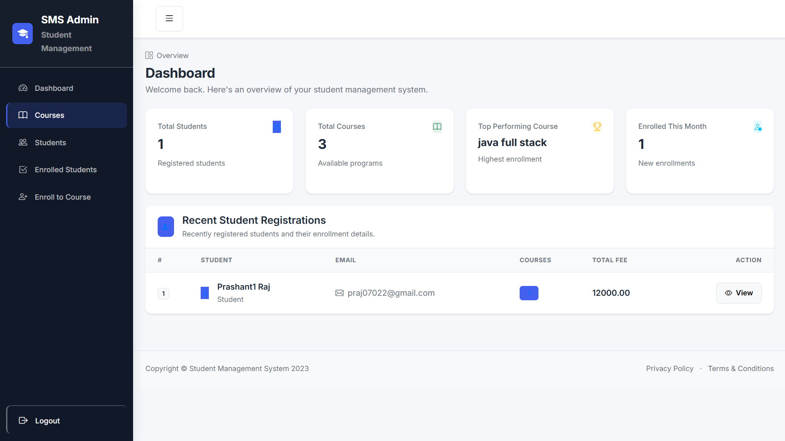
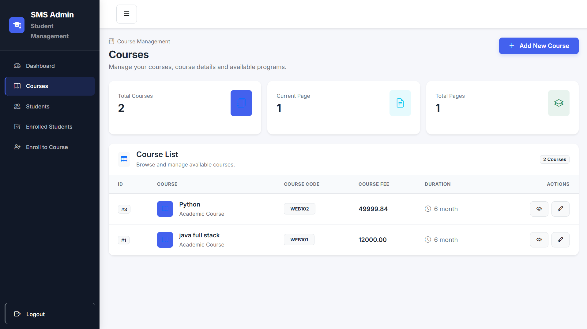
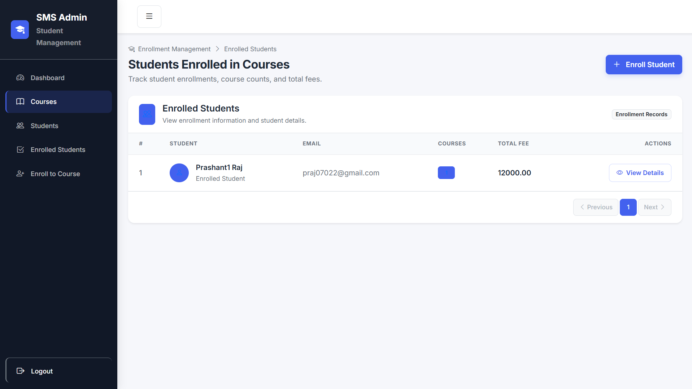
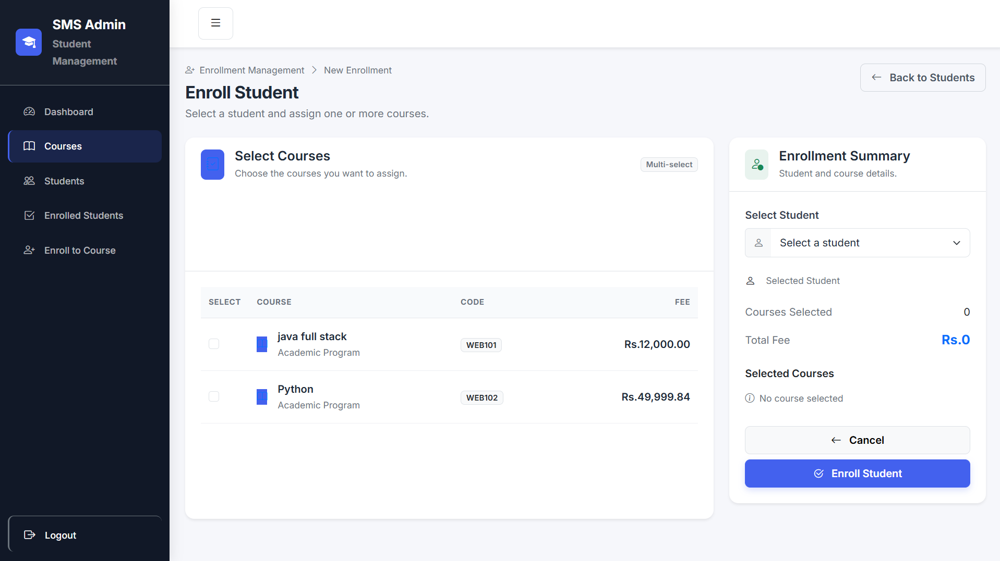

# Student Management System

A web-based Student Management System built using Spring Boot and Thymeleaf. This project helps manage students, courses, and enrollments through a clean and responsive dashboard interface.

## Features

- Secure Login System
- Dashboard Overview
- Course Management
  - Add Course
  - View Course
  - Update Course
- Student Management
  - Add Student
  - View Student Details
  - Update Student Information
- Enrollment Management
  - Enroll Students in Courses
  - View Enrolled Students
  - Enrollment Summary
- Responsive Admin Dashboard

## Technologies Used

- Java
- Spring Boot
- Spring MVC
- Spring Data JPA
- Spring Security
- Thymeleaf
- Hibernate
- MySQL
- Bootstrap 5
- Maven

## Screenshots

### Login Page


### Dashboard


### Courses Page


### Students Page


### Enrolled Students


### Enroll Student


## Project Structure

```text
src
├── main
│   ├── java
│   ├── resources
│   │   ├── templates
│   │   ├── static
│   │   └── application.properties
│   └── test
```

## Getting Started

### Clone the Repository

```bash
git clone https://github.com/praj07022/Student-Management-System.git
```

### Configure Database

Update your MySQL configuration inside:

```properties
src/main/resources/application.properties
```

### Run the Application

```bash
mvn spring-boot:run
```

Open:

```text
http://localhost:8080
```

## Author

Prashant Raj
